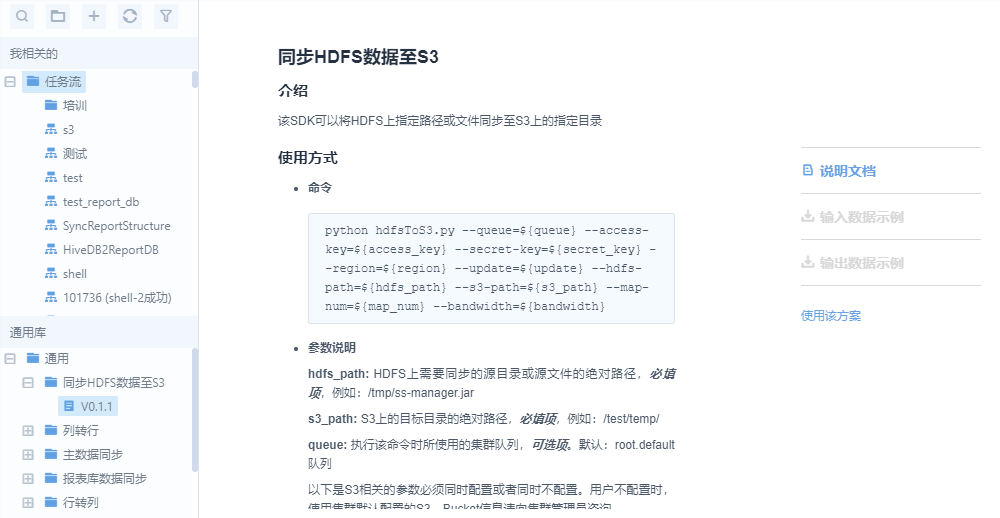

# Common library

EnOS provides various built-in SDKs in its common library to help you access and process data more conveniently. These SDKs lower the development thresholds and improve development efficiency.

## What's provided in the library

<body>
<table border="1" cellspacing="0" cellpadding="0">
  <tr>
    <td valign="top">
<strong>SDK name</strong>
</td>
    <td valign="top">
<strong>Description</strong>
</td>
  </tr>
  <tr>
    <td valign="top">
SYNC_HDFS_TO_S3
</td>
    <td valign="top">
Synchronize data from a specified path in HDFS to a specified   path in an S3 database.
</td>
  </tr>
  <tr>
    <td valign="top">
COLUMNS_TO_ROWS
</td>
    <td valign="top">
Converts row data of your HIVE table, where each row contains   values of all data collecting points of a device at a time, into a table   where each row contains historical values of a single data collecting point.
</td>
  </tr>
  <tr>
    <td valign="top">
SYNC_MDM
</td>
    <td valign="top">
Synchronizes master data to HDFS.
</td>
  </tr>
  <tr>
    <td valign="top">
SYNC_REPORT_DB
</td>
    <td valign="top">
Performs one-time synchronization of full-load of data from   Hive table to your target table.
</td>
  </tr>
  <tr>
    <td valign="top">
FLATTEN_POINTS
</td>
    <td valign="top">
Converts EnOS raw point data (each row contains historical   values of a single data collecting point) to sql-like row data (each row   contains values of all data collecting points of a device at a time).
</td>
  </tr>
  <tr>
    <td valign="top">
POWER_DATA_INTERPOLATION
</td>
    <td valign="top">
Interpolates power data, especially for the missing data of   production.
</td>
  </tr>
  <tr>
    <td valign="top">
SYNC_REPORT_STRUCTURE
</td>
    <td valign="top">
Transfers table structure from Hive database, to MySQL report   database.
</td>
  </tr>
  <tr>
    <td valign="top">
SHORT_TERM_LOAD_FORECAST
</td>
    <td valign="top">
For different power consumers in the grid, provides 0-6 days   load forecast for different-level of time granularity (15 min, 30 min, 1   hour, 1 day) based on historical data and optionally weather data.
</td>
  </tr>
  <tr>
    <td valign="top">
HADOOP_FILE_CRUSHER
</td>
    <td valign="top">
Combines many small files into fewer larger files.
</td>
  </tr>
</table>
</body>

## How to use the SDK

The major procedure of using the built-in SDK is as follows:

1. In **Data IDE** > **Task Designer**, browse the Common Library tree and locate the SDK that you want to use.
2. Double-click the version of the script and review the details about the script.
  

3. Click **Use the SDK**.

4. In the pop-out window, provide settings about the workflow.
  

5. Provide the scheduling settings. For more information, see [Creating a one-time workflow](creating_workflow_onetime) or [Creating a periodic workflow](creating_workflow_periodic).
