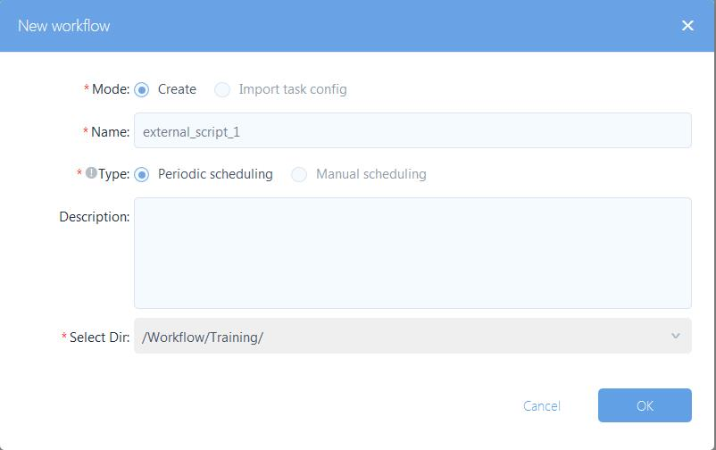
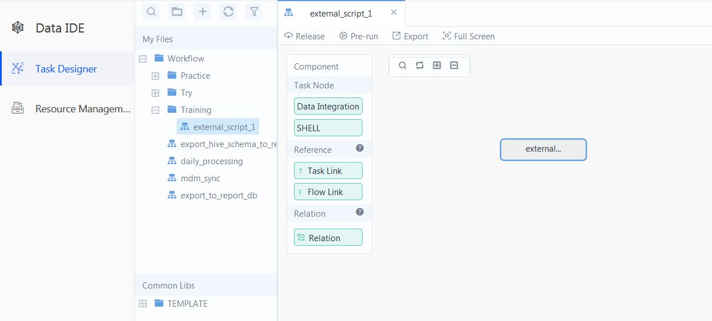
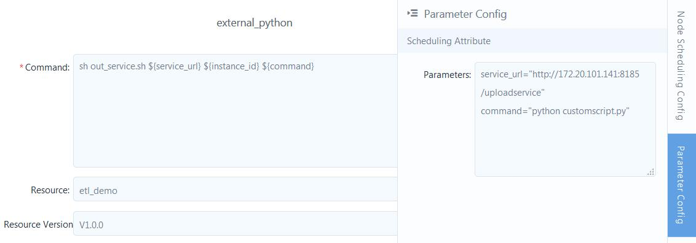
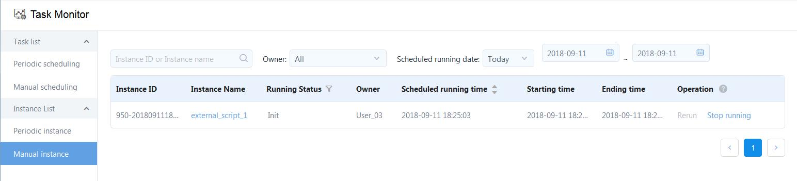
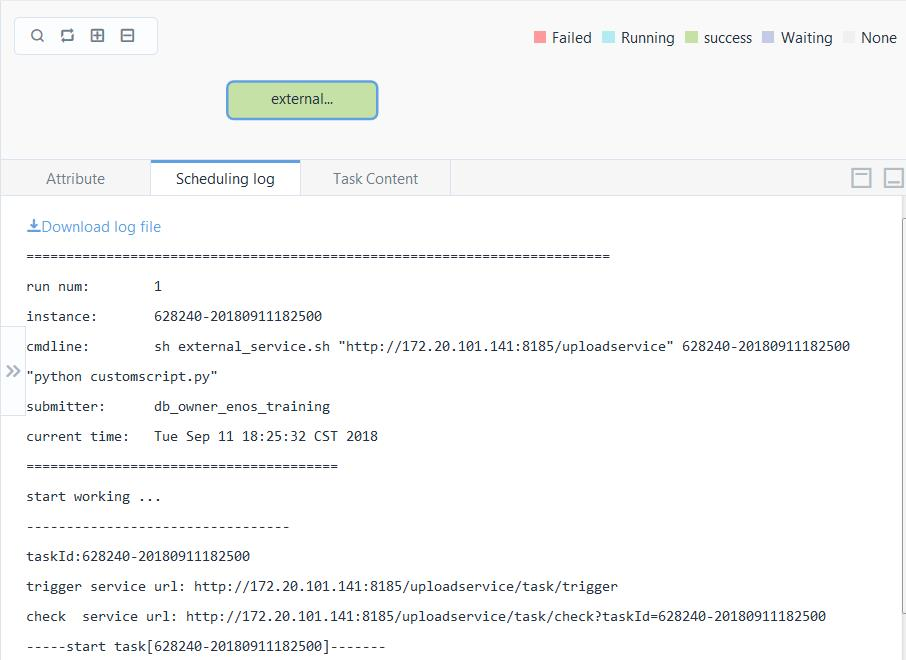

# Using EnOS Data IDE to run external Python scripts

EnOS provides the `external_service.sh` script to help you run your own scripts that are not built in EnOS. The sample code shows how to use the `external_service.sh` script with EnOS Data IDE to run your external Python scripts.

## Before you begin

1. Clone the sample files from the GitHub repo <https://github.com/EnvisionBigdata/dataide_external_script> to your local file system.
2. From your file system, open the directory that you cloned.
3. Replace the scripts and referenced files with your own files.
4. Compress all files in the directory into a `.zip` file, for example, `external_service.zip`.


## About the task

This task uses an example to instruct how to use the `external_service.sh` script to invoke the master script file [`example-conda.sh`](example-conda.sh).

The description about the sample code in this repository is as follows:
- The invoked script file `example-conda.sh` is created from the original script file `example.sh` by adding the following commands to install the Python packages that are needed to run the referenced Python scripts.
   ```
   source ~/.bash_profile
   envName=codeExample
   if [[ `conda create -y -n $envName python=2.7` ]]; then
     source activate $envName
     conda install -y pytz
     conda install -y pandas
     conda install -y boto3
     source deactivate
   fi
   source activate $envName

   ...
   ...

   source deactivate
   ```
- The files in the `inputFiles` directory are example input files, which contain non-standard data formats and structures, and therefore need restructuring and transformation.

- The `example-conda.sh` file calls several Python scripts, which process the data and upload the data into S3 database.

- The files in the `outputFiles` directory are example output files that conform to EnOS data conventions.

- The file in the `config` directory contains configuration that is needed for the Python scripts to run.

## Step 1. Upload the zip file into EnOS (Create resource)

Upload the `.zip` file as a resource of EnOS in the following procedure:

1. In the EnOS Console, click **Data IDE > Resource Management** from the left navigation panel and click **Create Resource**.
2. In the **Create Resource** window, provide the basic settings about the resource.
   - Name: Enter the name of resource.
   - Description: Provide a descriptive information about the resource.
   - Select Directory: Select the directy to save the resource.
	 Click **OK**.

3. Click **New version** and upload the `external_service.zip` file with settings as shown in the following figure:

   

## Step 2. Create a workflow with a task that references the resource.

1. In the EnOS Console, click **Data IDE > Task Designer** from the left navigation panel and click **New Workflow**.
2. In the **New Workflow** window, provide the following settings about the workflow and click **OK**
	 - **Mode**: Create.
	 - **Name**: external_script_1
	 - **Type**: Manual Scheduling
	 - Select Dir: the directory where you want to store the workflow.
   

3. From the **Component** panel, drag the **SHELL** type of task node into the workflow panel.

4. In the **New Task Node** window, provide name and description of the task. Click **Create**.

   

5. Double click the task node that you just created and provide the following settings about the task:
	 - **Command**: enter the following command:
	 ```
	 sh external_service.sh ${service_url} ${instance_id} ${command}
	 ```

    where, *service_url* and *command* are parameters that you'll define in the **Parameter Config** tab. *instance_id* is a system variable that indicates the identifier of the workflow instance.

	 - Select the resource and resource version that you uploaded in Step 2.

6. Click the **Parameter Config** tab from the right edge of the task configuration panel and provide the following settings:
	```
	service_url="http://172.20.101.141:8185/uploadservice"    
	command="python example-conda.py"  
	```
  **Note**: You'll need to edit the value of `command` with the name of your master script file.

   The following figure shows the task configuration in this example.

   

7. Click **Save**. Click **Back to workflow panel** and click **Release** to publish the workflow.

8. Click **Pre-run** to run the workflow.

## Step 3. Verify the results   

After you pre-run the workflow, a workflow instance is generated. You can then trace the details about the instance through the task monitor:
1. In the EnOS Console, click **Task Monitor** from the left navigation panel.
2. Click **Manual instance** and locate the instance through the name of the workflow. The workflow instance is shown as in the following figure:
	 
3. Click the name of instance from the table and double-click the task from the panel. You can then view the log by clicking the **Scheduling Log** tab.

    
