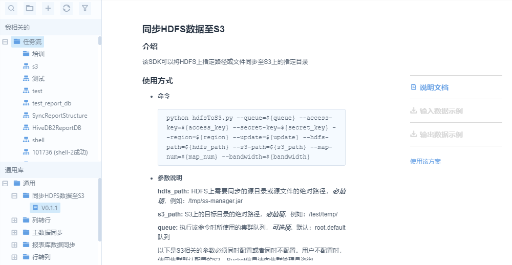
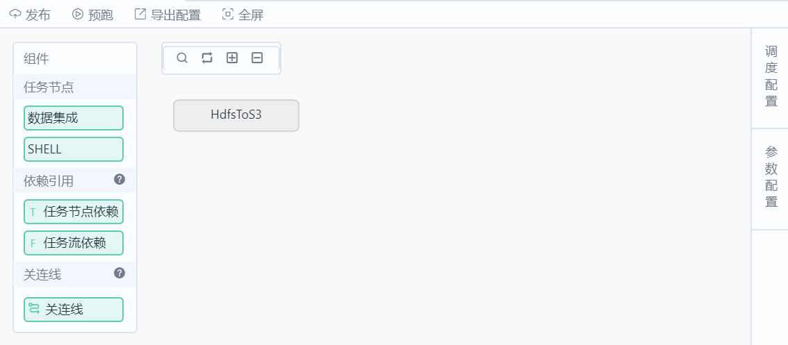

# Scenarios

The typical user scenarios of using Data IDE for data development are as follows:

## Running a built-in script

EnOS provides built-in scripts for the most frequently used data processing activities, such as synchronizing the master data from HDFS to an external S3 database, or converting columns to rows. For a complete list of built-in scripts that EnOS provides, see [Common library](common_library).

The major procedure of running a built-script is as follows:

1. Browse the Common Library tree and locate the script that you want to run.
2. Double-click the version of the script and review the details about the script.
  

3. Click **Use the Program**.

4. In the pop-out window, provide settings about the workflow.
  

5. Provide the scheduling settings. For more information, see [Creating a one-time workflow](creating_workflow_onetime) or [Creating a periodic workflow](creating_workflow_periodic).

## Running an external script

The major procedure of running an external script is as follows:
1. Upload your script as a resource on EnOS. For more information, see [Creating a resource](creating_resource).
2. Create a workflow with a SHELL-type of task that references the resource. For more information, see [Creating a one-time workflow](creating_workflow_onetime) or [Creating a periodic workflow](creating_workflow_periodic) according to your needs.

EnOS provides sample code to help you streamline this procedure, for more information, see [https://github.com/EnvisionBigdata/dataide_external_script](https://github.com/EnvisionBigdata/dataide_external_script).
