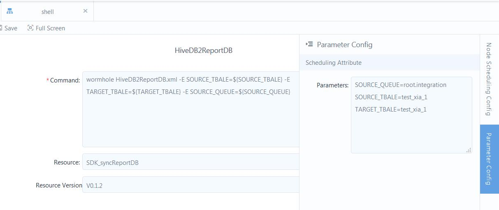

# Setting parameters for a workflow or SHELL-type of task

You can use parameters when you configure the workflow or task.

## Available options for parameters
You can specify constants, system variables, or custom variables for a parameter.

For what system variables you can use, see [System variables](system_variables).

## Procedure

The procedure is as follows:

1. When you are in the workflow to task configuration panel, click **Parameter Settings** from the right edge of the panel.
2. For each parameter that you used, provide the value in the **key=value** format. When you have multiple parameters to define, separate each parameter with an **Enter**.
```
key1=value1
key2=value2
```

The value can be a single value, or an array of values.
<!--Vivian: @weiwei, please list the syntax how to set value array-->

## Example: using parameter in SHELL script

For example, the following figure shows an example where parameters are used  in the SHELL script:
```
java -cp ide.sdk-0.1.3.jar com.envision.dataplatform.C2R.C2RBeelineUtil -i
${inputPath}  -o ${outputPath} -ot ${outputTableName} -ca ${columnAll} -cm
${columnMust} -cs ${columnSelected} -g ${group_name} -h "${HIVE_JDBC}" -u
${unix_timestamp} -z ${time_zone}
```

Where you can assign values for the parameters as follows:
```
inputPath=/user/hive/warehouse/xiaoxiao_product_db.db/input
outputPath=/tmp/xiaoxiao/output
outputTableName=2018_07_31
columnAll=projectid,deviceid,updatetime,envi_monitor_pm1,envi_monitor_pm25
columnMust=projectid,deviceid,updatetime,
columnSelected=envi_monitor_pm1,envi_monitor_pm25
time_zone=Asia/Shanghai
```

