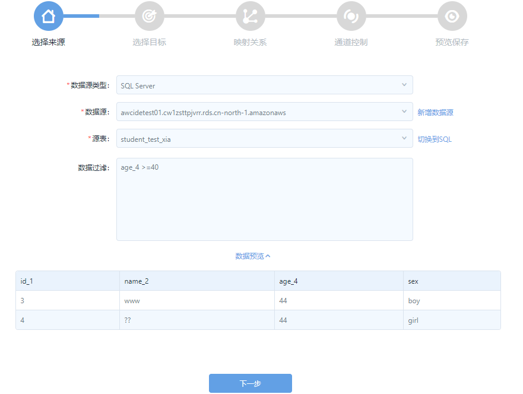
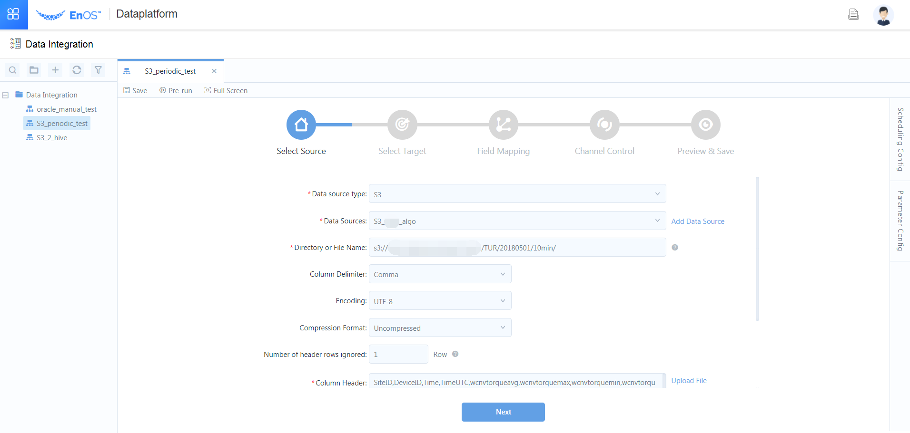
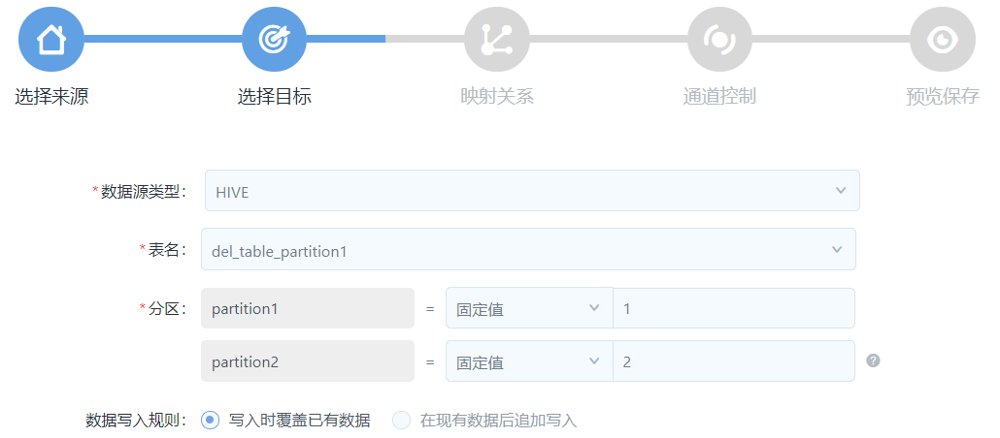
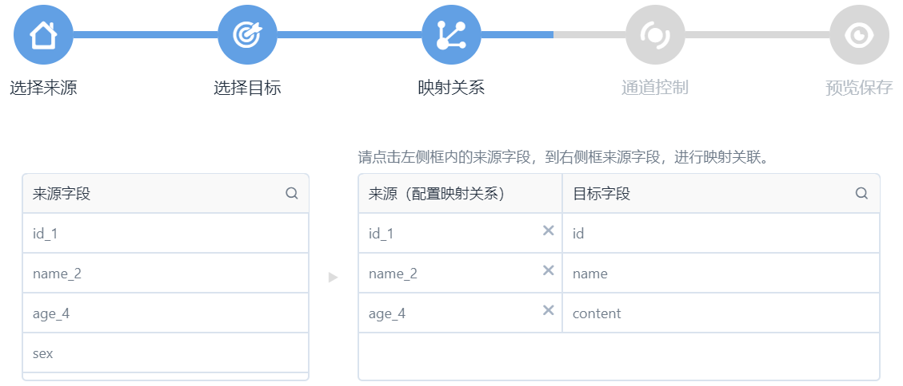

# Creating a one-time synchronization workflow from scratch

How to create a one-time data synchronization workflow from scratch.

## Before you begin

You must have created the target Hive table to synchronize the data to. For more information, see [Creating a Hive table](https://docs.envisioniot.com/docs/analysis-report/en/latest/data_explorer/creating_hivetable.html) in *Data Analysis and Report*.

## Step 1: Create an data integration workflow

1. Click **Data Integration** from the left navigation tree and click **New Data Integration Workflow**.
2. In the **New Data Integration Workflow** window, provide the basic settings about the workflow.
   - Mode: Select **Create** to create a workflow from scratch. If you select **Import from Configuration**, go to [Creating by importing an existing workflow configuration](importing_existing_config).
   - Name: Enter the name of workflow.
   - Type: Select **One-time**.
   - Description: Provide a descriptive information about the workflow.
   - Select Directory: Select the directory to save the workflow.

3. Click **OK**.

## Step 2: Select the data source

### SQL, MySQL, or Oracle database

When you select to synchronize from a SQL, MySQL, or Oracle database, provide the following settings:

1. Select from the list of existing data source or create a new data source. For more information, see [Data source overview](../data_source/datasource_overview).
2. Select which table to synchronize from the database.
3. (Optional) If you want to filter the data to be synchronized, provide the SQL query script. Note that you don't need to enter `where`. For example
   ```
   age_4 >=40
   ```

4. (Optional) Click **Preview Data**. You can then preview the resultant data to synchronize as shown in the following figure:
    

5. Click **Next**.

### Text-based data in FTP, SFTP, or S3

When you select to synchronize from an FTP, SFTP, or S3 data source, EnOS transforms the text-based data into a two-dimension table according to your settings:

1. Select from the list of existing data source or create a new data source. For more information, see [Data source overview](../data_source/datasource_overview).
2. Specify the URL to the data source. When the directory contains multiple files, the data records are merged. In this case, ensure that all data in the same directory has the same columns.
3. Specify the column delimiter that is used in the text-based data file, such as tabulator, comma, semicolon, space or other delimiters.
4. Specify the encoding format of the data file: UTF-8, GBK, or GB2312.
5. Specify the compression format of the data file.
6. Specify the number of header rows in the data file are to be ignored when loading the data.
7. Specify the header to add for the source table.
   

8. (Optional) Click **Preview Data**.
9. Click **Next**.


## Step 3: Select the target table

The only type supported now is Hive. Provide the following settings abut the target table.
1. Select the target table.
2. If the Hive table is partitioned, the partitions are automatically loaded.
3. Specify the target partition. You can specify the partition through the following methods:
   - Column name: The system creates new partitions based on the values in this column. If the column is date for example, and the column values are `20180501` and `20180502`, then two partitions are created, each for one day.
   - Fixed value: If 2017-10-11 is entered for example, the data will be automatically synchronized to the `2017-10-11` partition of the target table.
   - Placeholder: You can use system reserved or custom parameters, for example, the system variable `${cal_dt}`. For more information about the usage of system variable, see [System variables](../data_ide/system_variables).
      

4. Specify whether to overwrite the existing data in the target table, or append the data behind the existing data records.
5. Click **Next**.

## Step 4: Configure field mapping between source and target
In this step, you'll map the source fields to the target fields.

1. For each field in the **Target Fields** column, click the source field from the **Source Fields** column to map the source with target.
   
2. When you finish mapping each field, click **Next**.

## Step 5: Specify scheduling settings

1. Click **Scheduling Settings** from the right edge of the configuration panel.
2. Provide the basic settings:
   - **Owner**: Select the workflow owner from the list of users in the organization who have access to data integration. It is the workflow creator by default. As the creator, you cannot delete yourself. You can add othher owners, however, in the same organization.
   - **Description**: (Optional) Provide a description.
   - **Alert Mode**: Select how to alert the workflow owner. Email is always selected.
      - E-mail: an alert e-mail is sent to the owner when an instance meets the alert conditions.
      - SMS: A phone number must be verified during user registration for use of SMS alert. The SMS alert is sent to only the owner when an instance meets the alert conditions.


## Step 6: Specify parameters

When parameters are used when you configure the data source and target, specify parameter values. You can specify constants, system variables, or custom variables for a parameter. The procedure is as follows:

1. Click **Parameter Settings** from the right edge of the configuration panel.
2. For each parameter that you used, provide the values. For example, you may use parameter when you set the URL to your S3 data source:
  `s3://history/log_solar_dt_change_inverter/${test_list}.each_value`

  Where `test_list` is a parameter. You can then assign values for the parameter as follows:
  `test_list=Array[20170515,20170516,20170517,20170518,20170519,20170520]`

  You parameter setting will cause EnOS to synchronize all data from the directories as specified by the parameter values.

You can assign system variables as parameter values. For more information, see [Supported system variables](../data_ide/system_variables).

## Step 7: Configure concurrency
Select the number of concurrent connections to establish and click **Next**.

The database endures a larger load when you set a larger concurrency number. When the total transmission rate is fixed, the rate of a single concurrent connection is smaller.


## Step 8: Review and save the configuration

Preview the settings, edit when necessary, and click **Save** to save the synchronization configuration.

## What to do next

Click **Pre-run** to trigger the workflow.

After a workflow is run, an instance is generated. You can then trace the details about the instance through the task monitor. For more information, see [Task monitor](../task_monitor/monitoring_workflow_manual).

After the data is synchronized from the data source, you can schedule other processing tasks against the data. For more information, see [Data IDE](../data_ide/dataide_overview).
