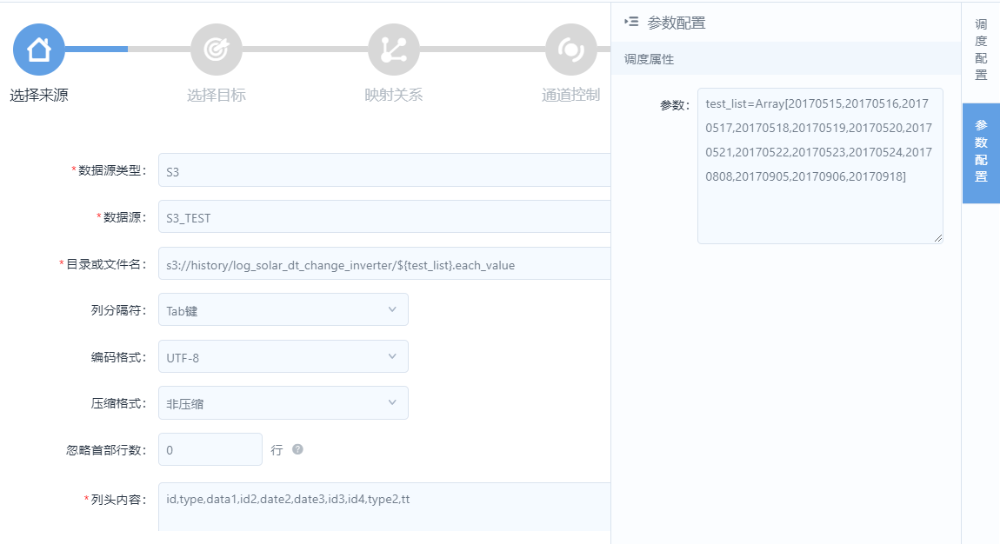

# Setting parameters for data integration workflow

You can use parameters when you configure the data integration workflow.

## Available options for parameters
You can specify constants, system variables, or custom variables for a parameter.

For what system variables you can use, see [System variables](../data_ide/system_variables).

## Procedure

The procedure is as follows:

1. When you are in the data integration configuration panel, click **Parameter Settings** from the right edge of the panel.
2. For each parameter that you used, provide the value in the **key=value** format. When you have multiple parameters to define, separate each parameter with an **Enter**.
```
key1=value1
key2=value2
```

The value can be a single value, or an array of values.
<!--Vivian: @weiwei, please list the syntax how to set value array-->

## Example: using parameter in URL

For example, you may use parameter when you set the URL to your S3 data source:
  `s3://history/log_solar_dt_change_inverter/${test_list}.each_value`

Where `test_list` is a parameter. You can then assign values for the parameter as follows:
  `test_list=Array[20170515,20170516,20170517,20170518,20170519,20170520,20170521,20170522,20170523,20170524,20170808,20170905,20170906,20170918]`


