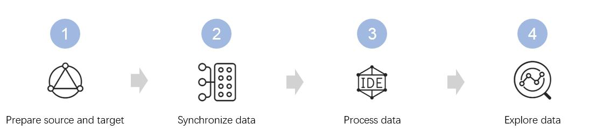

# Getting started with batch data processing
<!--
The short description should be a single, concise paragraph that contains one or two sentences and no more than 50 words.
Briefly mention what the user's learning goal is and include the following SEO keywords in the title short description: EnOS, ServiceName, tutorial.
-->

A typical flow to use EnOS to analyze your historical data is as follows:

## Step 1: Prepare the data source and target  

1. Prepare the data source.
   - If the data source is external, you'll first need to set up connection to the source data. EnOS supports to synchronize data from MYSQL, SQL, Oracle, FTP, SFTP, and Amazon S3 data sources. For information about how to connect to a specified database, see [Data Source](data_source/index).
   - If the data you want to process and analyze is on EnOS, such as the device master data accumulated and stored on EnOS. You can skip this substep.

2. Prepare the target Create a hive table hosted on EnOS to store the data synchronized from the data source. For more information, see [Creating a hive table](https://docs.envisioniot.com/docs/analysis-report/en/latest/data_explorer/creating_hivetable.html) in *Data Analysis and Report*.

## Step 2: Synchronize the data from your data source to EnOS

For external data source, you can create data integration workflows from sratch or from importing existing workflows to synchronize your data. You can schedule one-time or periodical workflows as you need. For more information, see [Data integration](data_integration/index)

For master data synchrization, you can use the Data IDE function to create a workflow that uses the `SYNC_MDM` program. For more information, see [Data IDE](data_ide/index).

## Step 3: Process the data

Use the Data IDE function to process your data, for example, converting columns to rows. EnOS provides rich data processing library that is ready to use.

For more information, see [Data IDE](data_ide/index).

## Step 4: (Optional) Explore the data

Optionally, you can use the Data Explorer function to help you perform interactive data analytics and visualization before you start to use the data for futher purposes such as dashboard and business intelligence. For more information, see [Data Explorer](https://docs.envisioniot.com/docs/analysis-report/en/latest/data_explorer/overview.html) in *Data Analysis and Report*.
