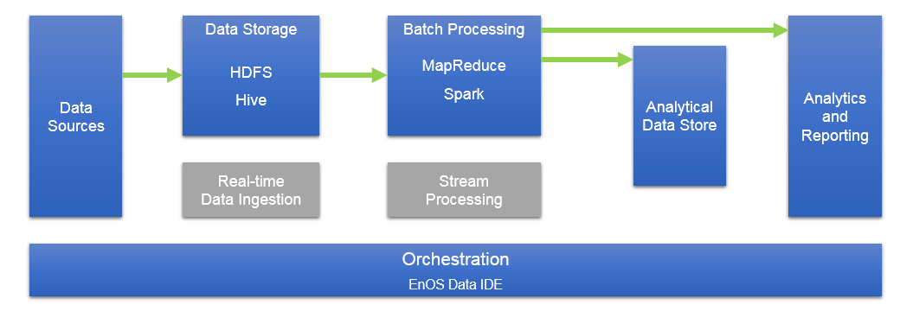

# Batch processing overview

The batch processing of big data is mainly targeted for _data at rest_. In this scenario, the source data is loaded into data storage, either by the source application itself or by an orchestration workflow. The data is then processed in-place by a parallelized job, which can also be initiated by the orchestration workflow. The processing may include multiple iterative steps before the transformed results are loaded into an analytical data store, which can be queried by analytics and reporting components.

## What is batch processing?

## When to use batch processing?

Batch processing is used in a variety of scenarios, from simple data transformations to a more complete ETL (extract-transform-load) pipeline. In a big data context, batch processing may operate over very large data sets, where the computation takes significant time. Batch processing typically leads to further interactive exploration, provides the modeling-ready data for machine learning, or writes the data to a data store that is optimized for analytics and visualization.

One example of batch processing is transforming a large set of flat, semi-structured CSV or JSON files into a schematized and structured format that is ready for further querying. Typically the data is converted from the raw formats used for ingestion (such as CSV) into binary formats that are more performant for querying because they store data in a columnar format, and often provide indexes and inline statistics about the data.
