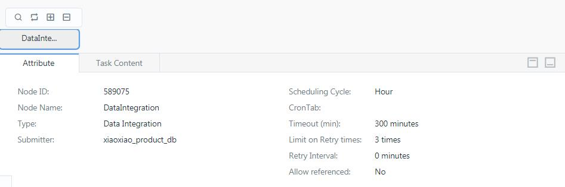
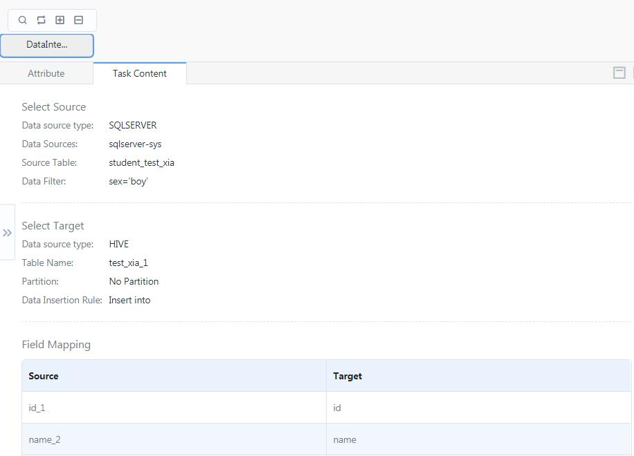
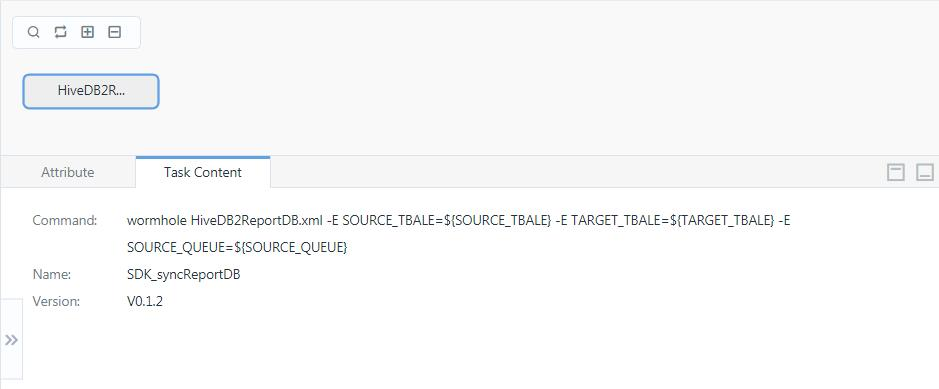

# Monitoring periodic workflow instances

For a period worflow, you can perform the following monitoring actions:
- Viewing the workflow instance
- Pre-running the workflow
- Pre-running a selected task in the workflow
- Pre-running a selected task and the subsequent tasks of the task
- Pausing a running workflow
- Resuming a paused workflow

## Viewing a periodic workflow

You can view general information about a workflow and the detailed information about each task that is run in the workflow.

To view a periodic workflow, do the following steps:
1. From the navigation panel, click **Task Monitor** > **Periodic Scheduling**. A table of all workflows that you have access to is shown in the right panel.
2. (Optional) In the search field above the table, enter the task ID or name to filter to result shown in the table.
3. Click the name of the workflow that you want to inspect details for from the table. A workflow panel is shown.
4. For each task node in the workflow, you can double-click the task node to view the following details:
  - Attributes: settings of the task that is defined at the design time

    

  - Task contents: what's run in the task. What's shown in the Task Contents tab varies according to the task type. The content of a data integration task might look something like this:

    

    While an SHELL task content would be something like this:

    

## Pre-running a workflow

To manually trigger a workflow, click **Pre-run** from the **Operations** column of the workflow and set the triggering time.

## Pre-running a task

To manually trigger a task within a workflow:
1. Click the name of the workflow from the table.
2. In the workflow panel, right-click the task and click **Pre-run** and set the triggering time.

## Starting and pausing a workflow

You can stop a workflow that is already started. In this case, the workflow will no longer run to generate an instance. To stop a workflow, click **Stop** from the **Operations** column of the workflow.

Conversely, a paused workflow can be resumed. In this case, it will automatically run in accordance with scheduled configuration. To resume a workflow, click **Start** from the **Operations** column of the workflow.
