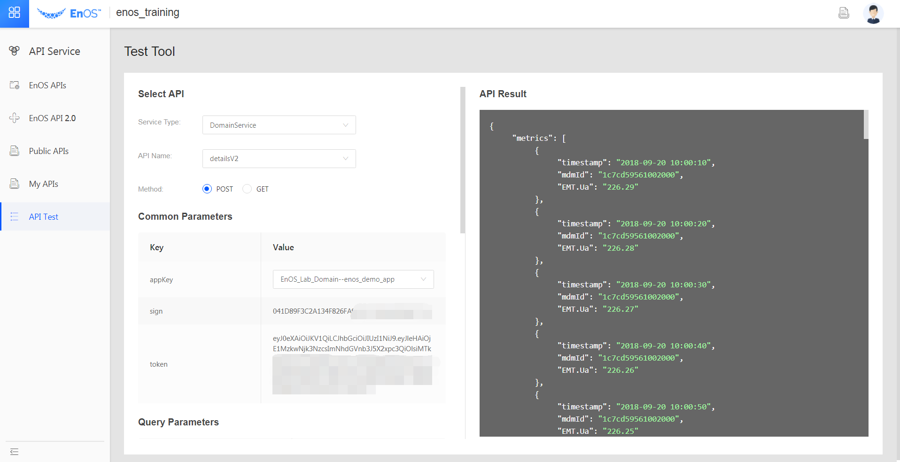
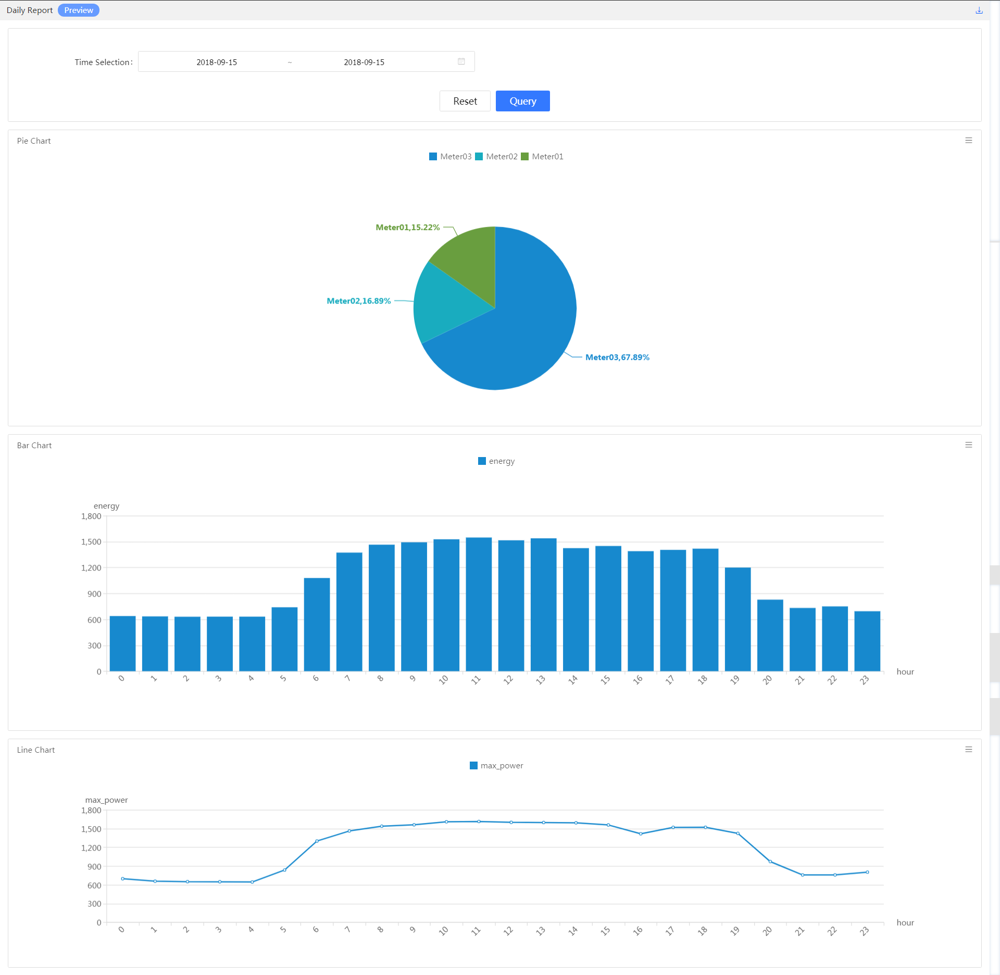

Tutorial
============

This is an entry-level experiment, which minimizes unnecessary coding and can be finished with basic knowledge on Java and SQL languages.

Audience
-------------------

Data Scientists

Application Developers

Duration
-------------------

2 hours

Objectives
-------------------

- Learn the forms of simple applications based on the EnOS platform;

- Master the ways of developing applications based on the EnOS platform;

- Master the ways of configuring and querying the alerts based on the EnOS
    platform;

- Master the ways of acquiring data from the platform through EnOS APIs;

- Master the ways of data exploring based on the EnOS platform;

- Master the ways of development and scheduling configuration of offline
    tasks;

- Master the usage of the BI reports;

Prerequisites
-------------------

- A personal computer.

Lab preview
-------------------

In this experiment, the data of 3 electrical meters are
pre-recorded for 24 hours. The pre-recorded data is played back through the device simulators
on the EnOS platform to simulate the access of the device data.

You are required to build a simple application based on these device data, which
supports the following functions:

- Inquiry of alerts of devices;

- Acquisition and display of device properties, real-time and historical data;

- Visualization of business performance indicators.

To reduce the non-core coding work, you are only required to print your results
on the EnOS console for the display of alerts and device data inquiries, as
shown in the following figure:

.. image:: media/overview_Acquiring_device_data_and_printing_API.png
   :alt: Fig. Acquiring device data and printing it onto the console by running Java codes that call the EnOS API

Based on the objectives of building the above-mentioned simple applications, the
whole experiment consists of the following steps:

1. Logging in to the EnOS Portal and browsing through the funtion menus in the
    Portal;

2. Creating your own applications in the EnOS Portal;

3. Configuring the alerts in the EnOS Portal;

4. Querying the device data using the API testing function in the EnOS Portal;

5. Writing your own Java programs and acquiring the device properties, real-time and historical data with it by calling the EnOS API (Optional, as Java code writing is required);

6. Using the **Data Explorer** function in the EnOS Portal to perform the preliminary analysis on the historical data of the device ( HiveQL language is required);

7. Creating batch tasks using the **Data IDE** function in the EnOS Portal, processing the historical device data regularly (Optional, as writing shell, HiveQL and MySQL scripts is required);

8. Displaying business statistical indicators by using the **BI & Reports** function in the EnOS Portal.

Learning modules
-------------------

.. toctree::
   :maxdepth: 2

   data_instructions_on_experiment_overview
   module_1
   module_2
