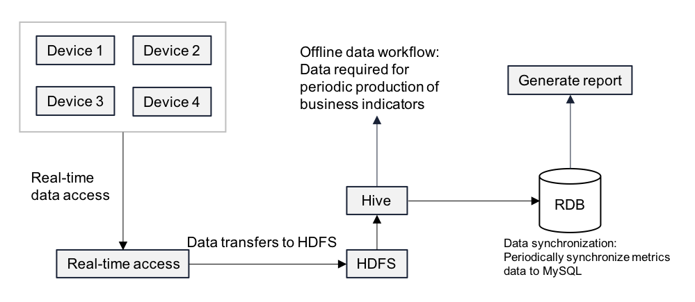
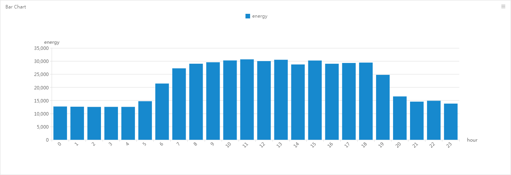
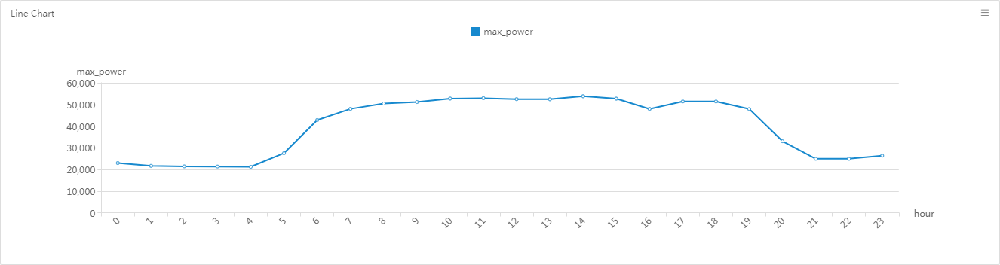
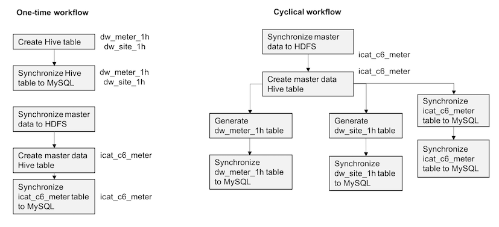

Tutorial
============

This is an entry-level experiment, which minimizes unnecessary coding and can be finished with basic knowledge on Java and SQL languages.

Data processing learning overview
----------------------------------

As the functions for data processing to be introduced in the following
experiments are closely connected with one another, we designed a complete workflow, which will help you better understand the
relevant concepts and tasks of offline data processing.

This overview section aims to help you:

- Understand the overall process of data processing;
- Gain a clear overall goal for the subsequent learning modules;
- Help you disassemble the overall goal into several easy-to-achieve subtasks;

Summary of data processing
`````````````````````````````

The following learning modules deals with handling the offline data stored on the platform. The common process is as follows:

1. Perform a preliminary analysis on the data stored on the platform (e.g., the device data connected into EnOS through edge) through **Data Explorer** to understand what data you have in hand, in what forms they are stored, and their characteristics, etc.

2. Determine how to design your data warehouse based on your business needs (how many layers are needed between the raw data and the final business indicator data, and what data required foreach layer, etc.);

3. Create the hive tables through the **Data Explorer** service.

4. Develop batch processing workflows through the **Data IDE** service and configure the dependencies among the tasks and their respective  scheduling cycles.

5. Based on your business needs, prepare the reports for your business indicators through the built-in **BI & Report** service and synchronize the data into your business relational database for further processing and presentation.

Objectives
```````````````

In the following learning modules, you'll design batch processing workflows against the historical data of your devices, and render the statistical report for the data. The data flow is as shown in the following figure:




In this experiment:

1. Three electrical meters are simulated with the EnOS device simulators, and data is continuously sent to the platform.

2. The simulated data generated in 1 is saved into the HDFS as a file through the real-time stream.

3. EnOS supports the management of the data in the HDFS through Hive, and the original data is saved in the pointrecords table in Hive. You are required to build a data warehouse in Hive.

4. You'll create a periodic batch data processing workflow, generate the business data required by the report from the original pointrecords table.

5. You'll configure a task to regularly synchronize the business data from Hive to the relational databases corresponding to the reports.

6. You'll create a view from the relational database and generate a business report.

Let's suppose that the business goal of the experiment is to show the following statistical indicators of the three electric meters:

- The statistics of the total active electricity consumption of the three meters on the hours of the day;
- The statistics of the maximum total active power of each of the three meters during each hour of the day;
- The percentage of active power electricity consumption for each of the three meters;






Design of batch processing workflow
```````````````````````````````````````

To achieve the planned business goals, the data processing workflow will comprise tasks as shown in the following figure:




Learning modules
-------------------

.. toctree::
   :maxdepth: 2

   module_1
   module_2
